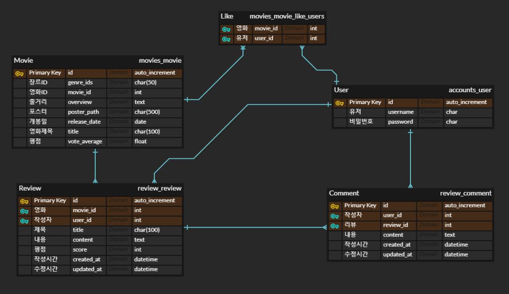

# Final Project

기간: 21.05.20 ~ 21.05.27

개발 환경

- python 3.8+
- Django 3.X
- Node 14.X
- Vue.js 2.+

Tools

- Viual Studio Code
- Chrome Browser

Architecture

- Back-end: Django REST API 
- Front-end: Vue.js(vuex)

주제: 영화 리뷰 사이트

## 1. 팀원 정보 및 업무 분담 내역 

팀원: 고동건, 박선주

업무: 기능별로 차례대로 제작

5/20 

1. 로그인 
   백: jwt기반 로그인, 
   프론트: 브라우저(로컬 저장소)에 저장, 로그인 폼
2. 회원가입
   백: 커스템 유저 모델 작성, 시리얼라이저 작성, 아이디 db 저장
   프론트: 회원가입 폼

3. 전체 영화리스트
   백: TMDB 데이터 받아서 json으로 변환, serializer 사용해서 프론트 전달
   프론트: 데이터 받아서 영화리스트 출력, bootstrap 사용(card)

4. 영화 정보 (detail)
   백: X
   프론트: boostrap modal 사용, 유튜브 트레일러 재생

5/21

1. 영화 리뷰

   백: api

   - 리뷰 CRUD 구현
   - 댓글 crud

   프론트: 

   - 디테일 페이지에 리뷰 작성 버튼
   - 리뷰 작성 폼
   - community(리뷰만 모아놓은 페이지)
   - 리뷰 상세 페이지 및 댓글

5/22

1. 영화 리뷰

   백:

   - RESTFul API 으로 수정

   프론트: 

   - 댓글 수정 기능 : 리뷰 상세 페이지에서 JS로 구현
   - 디테일 페이지에 리뷰 몇개 보여주기

2. 개인페이지

   백: 

   - 영화 좋아요 구현
     - movie에 manyToMany field 추가
     - 마이페이지에 같이 들어갈 api 작성
   - 추천 알고리즘 작성

   프론트:

   - 디테일 페이지 좋아요 버튼
   - 개인 페이지 구성
     - 좋아요 누른 영화
     - 작성한 리뷰 목록
   - 영화 추천 페이지 구성

5/23

프론트: 디자인 적용 및 프론트 재구성

박선주:

- 배경 사진 삽입
- Community(게시판 느낌 )

  - 포스터, 영화제목, 리뷰제목

  - 페이지네이션

고동건:

- 개인 페이지나 추천 페이지에서 영화를 눌렀을때 뜨는 modal분리

5/24 

박선주:

- 상세 페이지: 심플하게, 평점추가, 댓글 디자인

- 리뷰 작성 페이지: 심플하게, 평점 추가

- myPage nav signup 로그인 디자인

고동건:

- Movie: 마우스 오버 이벤트(Hover/ 클릭 하지 않고 마우스 포인터만 올렸을때 이름, 장르만 나오게)

- carousel modal 에러 해결

- 리뷰 작성 페이지 평점(star rating)

## 2. 목표 

목표

에러없는 영화 리뷰 홈페이지 제작

실제 구현 정도 

로컬에서 모든 기능이 정상작동

배포하지 않음

## 3. 데이터베이스 모델링(ERD) 

좋아요 - User : Movie (M:N)

작성자 - User : Review (1 : N)

리뷰 - Movie : Review (1:N)

댓글 - Review : Comment (1:N)

댓글 - User : Comment(1:N)

## 4. 필수 기능 

1. 회원가입
   1. client 에서 회원가입 양식에 맞게 넘겨주면 server에 저장
   2. 양식이 맞지 않으면 error 발생(http 400) 
   3. 해당 값을 다시 받아서 alert로 client에 알림
2. 로그인
   1. Django Rest Framework JSON Web Tokens 사용 (`djangorestframework-jwt`)
   2. Client의 local storage에 JWT를 저장하고, decoding해서 해당 username과 userid도 vuex state에 저장
3. 영화정보 페이지
   1. 데이터 수집 및 DB 입력
      1. Python을 사용해서 TMDB의 영화 정보 수집후 json으로 변환
      2. json 파일을 loaddata로 server DB에 입력
   2. 전체 영화 정보 출력
      1. Movies에 들어가면 (vue state에 없는경우) server에 요청
      2. Movies 앱에 요청이 들어오면 DB의 모든 데이터 전송
      3. vue state에 저장해서 출력
   3. 개별 영화 클릭시 상세 정보
      1. State에 저장되어있는 정보에서 출력
      2. 영화 클릭시 Server API와 youtube API를 사용하여 리뷰, 좋아요 상태, 관련 영상 출력
4. 영화 추천 페이지
   1. 개인 리뷰 기반 영화 추천
      1. 리뷰 영화의 장르를 뽑아서 가장 많이 작성된 장르를 기반으로 추천
      2. 없는 경우 DB에서 랜덤으로 뽑아서 10개 출력
   2. 평점이 높은 영화 추천
      1. DB에 저장되어있는 평점 순으로 추천
   3. TMDB API top rate를 사용해서 출력
5. 개인 페이지 
   1. 좋아요 누른 영화, 작성한 리뷰, 댓글 확인 가능 (역참조)

## 5. 배포 서버 URL 

배포하지 않음

## 6. 느낀점

고동건

선주님과 약 일주일간 협업했는데 힘들면서도 정말 재밌었습니다.

배운걸 써먹는다는게 어려운일인지 알고있었는데 직접해보니 더 어렵네요

항상 알려주던 교수님이 없어서 구글 선생님만 믿고 했는데 구글 선생님도 다 알려주지는 못하더라구요

그래도 지식을 기반으로 검색해서 찾아내고 기능을 하나하나 만들어가는 과정이 뜻깊었습니다

선주님도 적극적으로 해주시고 제가 막히는 부분에 대해서 잘 알려줘서 조금더 쉽게 만들수 있었습니다.

굿~

박선주

시간을 정말 전부를 쏟겠다고 플젝 전에 투표했었는데 동건님 보다 많이 투자하지 못해서 죄송스럽다.

Carousel / Modal 등 어려운 구현 부분을 잘 해주셔서 덕분에 프로젝트가 완성도 있게 마무리가 된 것 같았다.

無에서 부터 백 ~ 프론트를 구현하려니 처음에는 막막했지만 주요기능 하나하나 완성해나가고 연동해가면서

1학기를 총 정리 할 수 있었던 시간이었다. 벌써 2학기가 기대되기 시작한다!!!